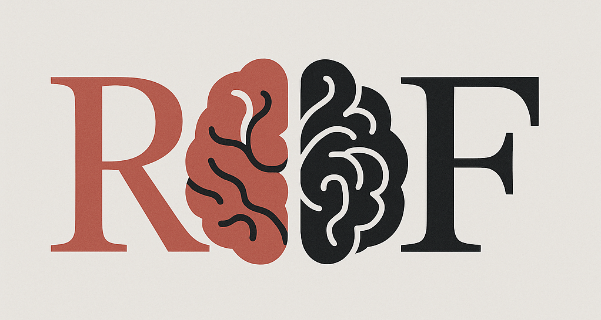
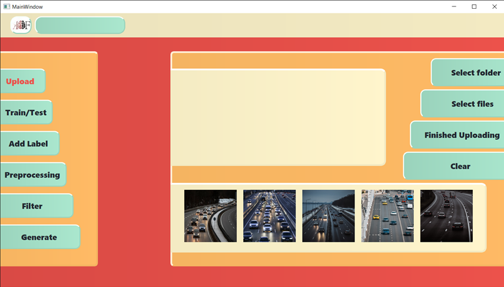
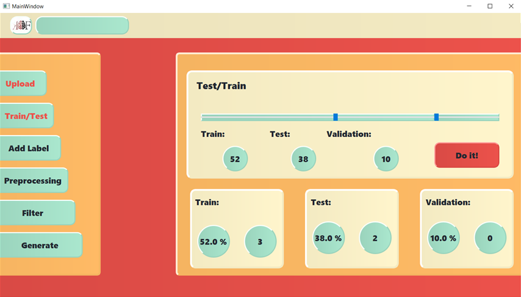
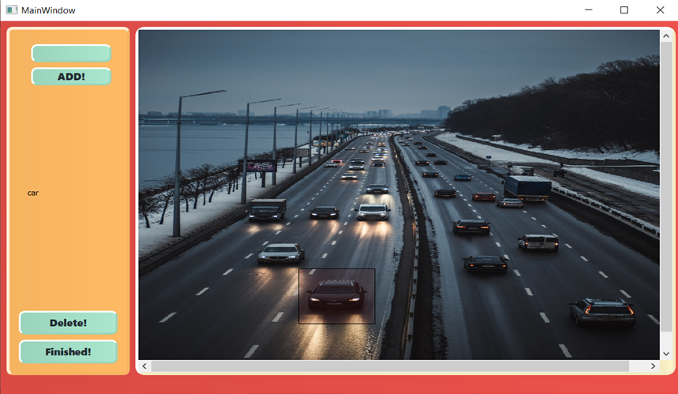
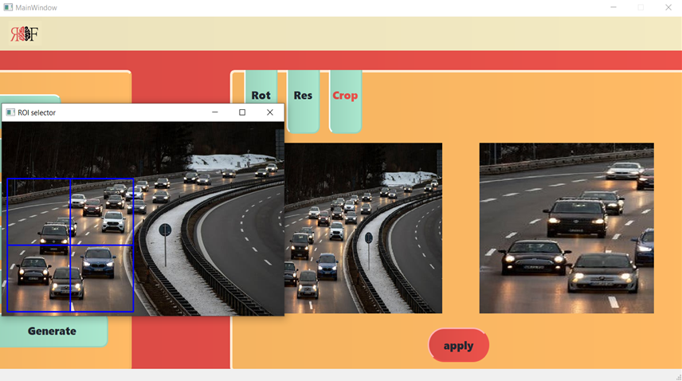
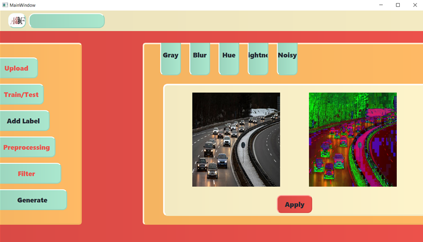
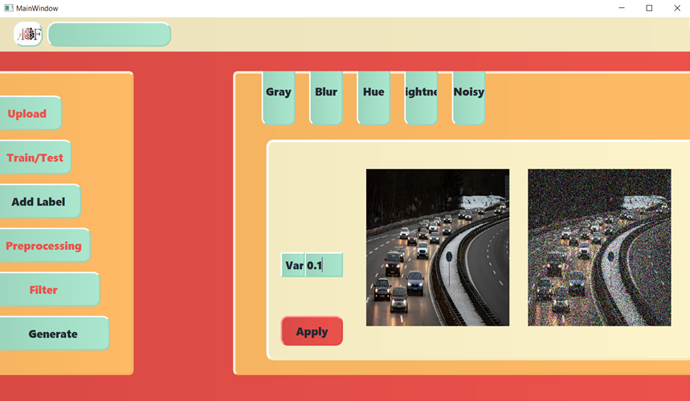

<p align="center">
  
</p>

<h1 align="center">🧠  RoboFlow</h1>

<p align="center">
A PyQt5-based GUI application for image preprocessing, filtering, and labeling—tailored for machine learning and computer vision workflows. Roboflow offers an intuitive, interactive way to prepare datasets for model training and experimentation.
</p>


## 🎮 Features

- 📂 Select image files or entire folders.
- 🏷 Manually assign labels to images
- ✂️ Preprocess images (crop, rotate, resize)
- 🎨 Apply image filters (grayscale, blur, hue, brightness, noise)
- 🧪 Create train/test splits
- 💾 Save fully processed datasets
- 🖼️ User-friendly GUI with Qt


## 🎨 Filter Functions

| Filter       | Effect |
|--------------|--------|
| **Gray**     | Converts the image to grayscale using OpenCV’s color space transformation |
| **Blur**     | Applies a Gaussian blur to soften the image and reduce noise |
| **Hue**      | Rotates the hue values within HSV color space to shift the color tone |
| **Brightness** | Adjusts the brightness intensity from 0% (dark) to 100% (bright) |
| **Noisy**    | Adds Gaussian noise with zero mean and user-defined variance to simulate realistic image noise |


## 🚀 Getting Started

### 🔩 Requirements

- Python 3.x
- PyQt5
- OpenCV

### 📦 Installation

``` bash
git clone https://github.com/sepehrgh98/Roboflow.git
cd Roboflow
pip install pyqt5 opencv-python
```
### ▶️ Run the Application

``` bash
python main.py
```

## 🚀 How to Use

1. Launch the app and select/create a project

2. Upload images or a folder of images

<p align="center">  </p> 

3. Split Train & Test

<p align="center">  </p>

4. Label selected images

<p align="center">  </p>

5. Apply desired preprocessing (Rotation, Resize, and Crop)

<p align="center">  </p>

6. Apply desired filter (Grayscale, Blur, Hue, Brightness, and Noise)

<p align="center">  </p>

<p align="center">  </p>

5. Generate the final dataset and export

## 📄 License

This project is licensed under the [MIT License](LICENSE).


## 🙏 Acknowledgments
We would like to express our sincere gratitude to everyone who supported and contributed to the development of Roboflow. This project was completed as part of the Advanced Programming course and represents a collaborative effort in applying software engineering principles to a real-world computer vision task.

Special thanks to:

Professors and instructors for their guidance and technical feedback throughout the course

- Sepehr Ghamari, for leading the architectural design and PyQt integration

- Mohammad Saleh Behzadpour, for implementing the preprocessing and filtering modules

- Mohammad Daviranfard, for managing GUI flow, labeling tools, and project coordination

This project would not have been possible without the teamwork, dedication, and shared vision of the contributors.

## 📬 Contact

If you have any questions or feedback, feel free to contact us at:

📧 sepehrghamri@gmail.com